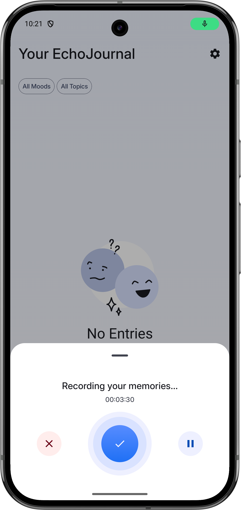
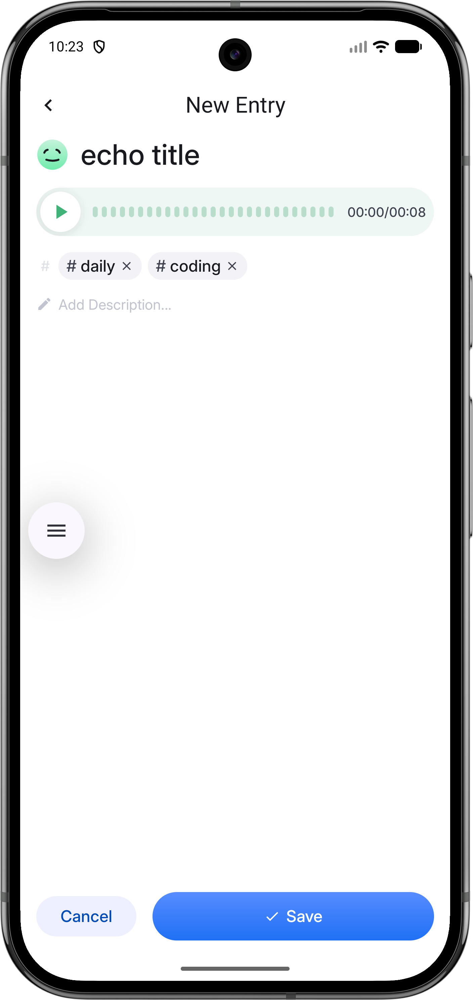
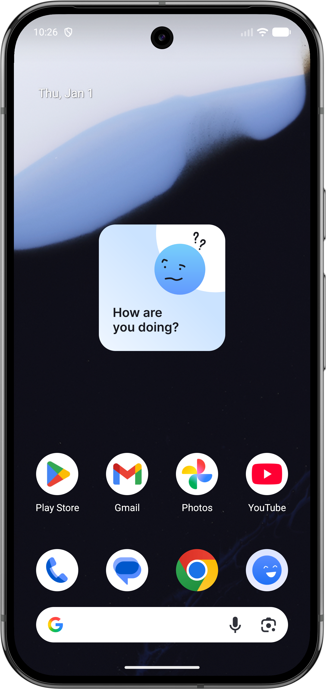

# EchoJournal


A modern voice journaling app built with Jetpack Compose that lets you capture your thoughts and feelings through audio recordings. Organize your entries by mood and topics, making it simple to reflect on your experiences over time.

## Screenshots

<p align="center">
  
  
  
  
</p>

## Features

**Voice Recording**
- Quick recording via long-press gesture for instant capture
- Standard recording mode with pause/resume controls
- Real-time audio waveform visualization
- Home screen widget with deep link for instant recording

**Organization & Management**
- Tag entries with moods and custom topics
- Filter recordings by mood or topic combinations
- Timeline view with relative dates (Today, Yesterday, etc.)
- Swipe gestures: left to share, right to delete
- Audio playback with visual progress tracking

**User Experience**
- Material 3 design with edge-to-edge display
- Smooth animations and intuitive gestures
- Confirmation dialogs for destructive actions

## Technical Stack

**Architecture**
- Clean Architecture with clear separation of concerns
- MVVM pattern with unidirectional data flow
- Dependency injection with Koin
- Type-safe navigation using kotlinx.serialization

**Core Technologies**
- Jetpack Compose for modern declarative UI
- Kotlin Coroutines & Flow for async operations
- Room Database with multi-table relationships
- Material 3 components and theming

**Key Libraries**
- Navigation Compose for type-safe screen routing
- Accompanist Permissions for runtime permission handling
- MediaRecorder API for audio capture

## Architecture Overview

The app follows Clean Architecture principles with three main layers:

```
app/
├── data/           # Repository implementations, Room DAOs
├── domain/         # Business logic, use cases, entities
└── presentation/   # ViewModels, Compose UI, screens
```

**Data Flow:**
1. User interactions trigger Actions in the ViewModel
2. ViewModels emit State updates via StateFlow
3. UI recomposes reactively based on State changes
4. One-time events (navigation, toasts) flow through Event channels

**Database Design:**
- Normalized schema with junction tables for many-to-many relationships
- Type converters for complex types (List<Float>, Instant)
- Flow-based queries for reactive UI updates

## Permissions

The app requires the following permission:
- `RECORD_AUDIO` - Required for voice recording functionality

## Screens

**Echos Screen**
- Displays all voice recordings in a timeline format
- Filter by mood and topic with dropdown selectors
- Quick record via FAB or long-press
- Swipe gestures for delete and share actions

**Create Echo Screen**
- Add title and optional note to recordings
- Select mood from predefined options
- Tag with multiple custom topics
- Audio playback preview with waveform

**Settings Screen**
- Configure default mood for new recordings
- Set default topics for quick entry creation
- Personalize your journaling workflow

---
